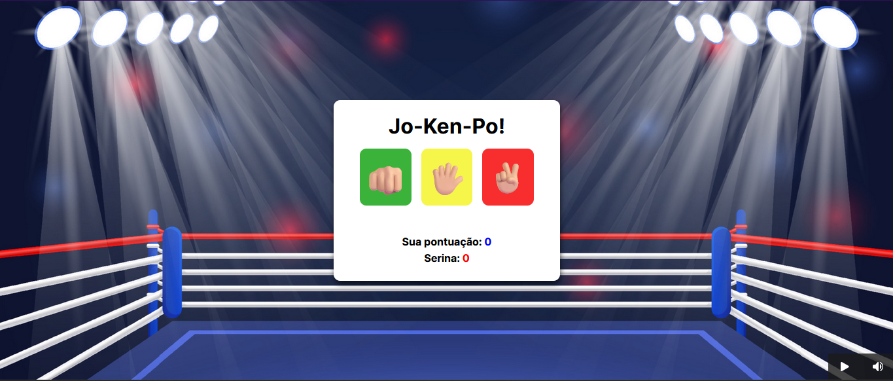

# jo-ken-po

## Sumário

- [Visão geral](#visão-geral)
  - [O Desafio](#o-desafio)
  - [Screenshot](#screenshot)
- [Links](#links)
- [Meu processo](#meu-processo)
  - [Tecnologias](#tecnologias-usadas)
  - [O que eu aprendi](#o-que-aprendi)
  - [Dificuldades](#dificuldades)
- [Contato](#contato)

## Visão Geral

### O Desafio

Os usuários devem ser capazes de:

- Interagir com o layout ideal para o aplicativo, dependendo do tamanho da tela do dispositivo;
- Interagir com os estados de foco para todos os elementos interativos na página;
- Conseguir clicar em sua escolha de jogada e se divertir, com uma boa música de fundo, como todo bom jogo proporciona!

### Screenshot

## Links

- Repositório: https://github.com/mazziera/jo-ken-po-
- Deploy: https://mazziera.github.io/jo-ken-po-/

## Meu Processo

### Tecnologias usadas:

- HTML5 Semantico
- CSS3 responsivo
- Javascript

### O que aprendi?

- Pude consolidar conhecimentos e conceitos em Javascript, manipulando a DOM e trabalhando com condições de resultados, utilizando funções paramettrizadas que retornam um valor.

### Dificuldades

- Apesar de ter compreendido todo o processo lógico e sintático, ainda me encontro com dúvidas de como resolver alguns pontos lógicos da aplicação. 

## Contato

- Github - [mazziera.io](https://github.com/mazziera)
- Linkedin - [@raphael-mazzieri](https://www.linkedin.com/in/raphael-mazzieri/)

